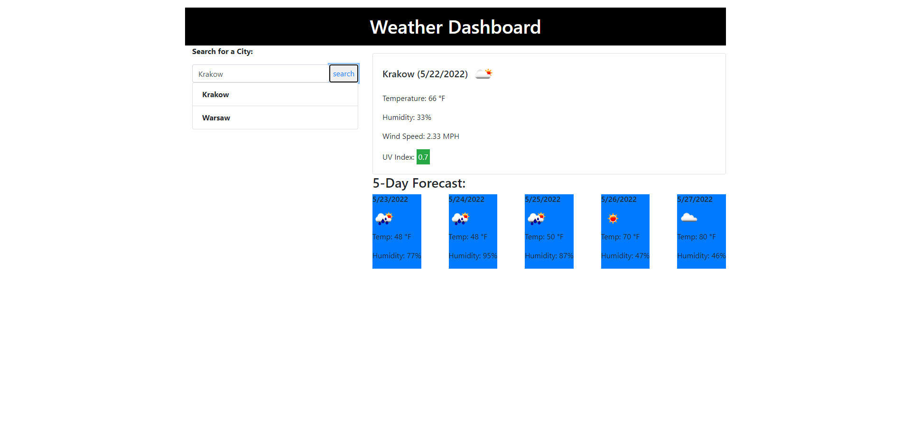

# weather-dashboard

# User Story

AS A traveler
I WANT to see the weather outlook for multiple cities
SO THAT I can plan a trip accordingly

# Acceptance Criteria

GIVEN a weather dashboard with form inputs
WHEN I search for a city
THEN I am presented with current and future conditions for that city and that city is added to the search history
WHEN I view current weather conditions for that city
THEN I am presented with the city name, the date, an icon representation of weather conditions, the temperature, the humidity, the wind speed, and the UV index
WHEN I view the UV index
THEN I am presented with a color that indicates whether the conditions are favorable, moderate, or severe
WHEN I view future weather conditions for that city
THEN I am presented with a 5-day forecast that displays the date, an icon representation of weather conditions, the temperature, the wind speed, and the humidity
WHEN I click on a city in the search history
THEN I am again presented with current and future conditions for that city

# Screenshot

# Links

Github repository- https://github.com/smckelli/weather-dashboard

Github website- https://smckelli.github.io/weather-dashboard/

# Challenges

This has been an exceptionally difficult challenge for me for a number of reasons, mostly due to personal committments away from the bootcamp during this instructional week. Most if not all of the credit for this assignment goes to Jody Brzovski for supplying the bulk of the code. Her repo is located here https://github.com/JodyBrzo/weather-dashboard. Upon revisiting this assignment I find the assignment to still be very difficult for me. Through her code I was able to walk through a successful code and understand the code in a way I would have never been able to develop myself entirely. 